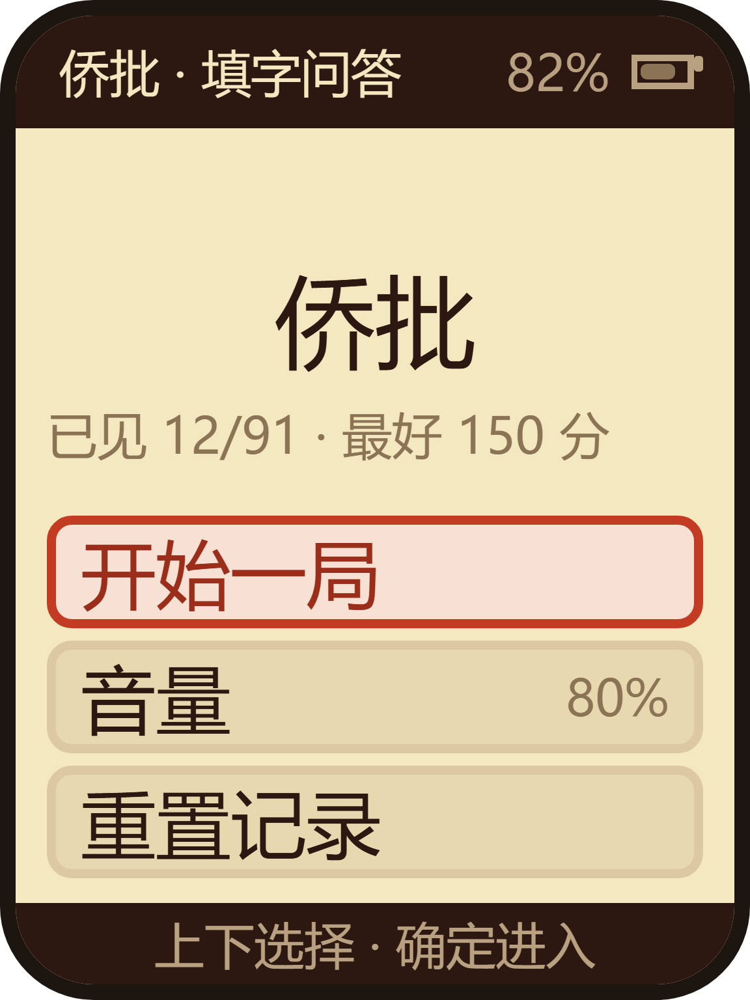
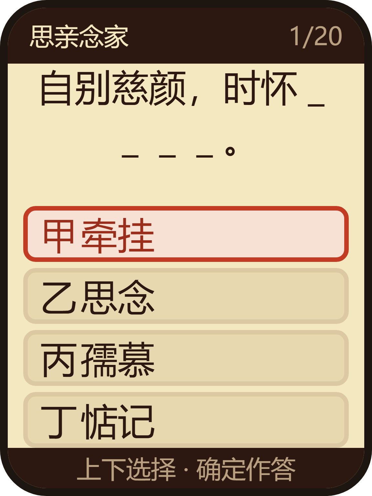
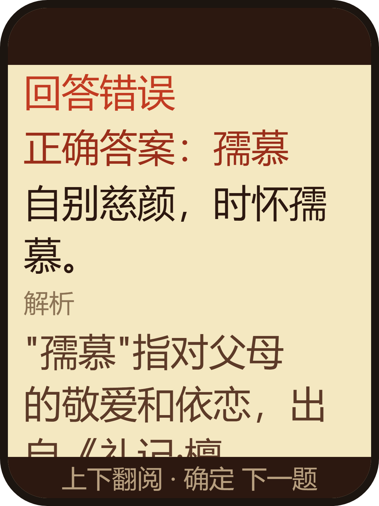
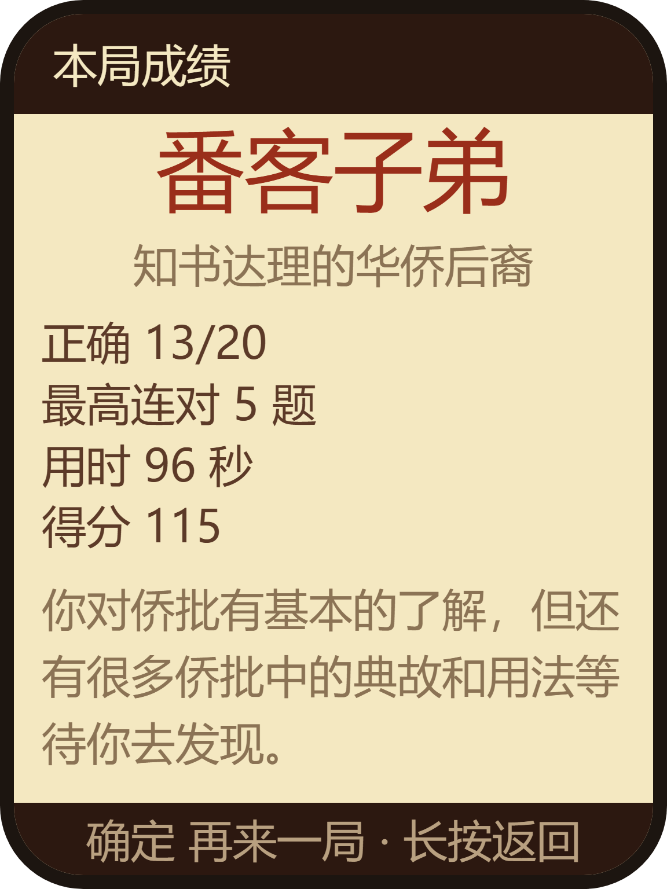

<p align="right">
  <strong>简体中文</strong> · <a href="README.md">English</a>
</p>

# 侨批 · 填字问答

一台三键、离线的手持游戏：**每局 20 道题**，题目都是一封真实侨批里的一句话，挖掉一个短语，
由你从四个候选里挑出被挖掉的那个。91 道题、方言朗读与背景音乐全部装在机器里，
**不联网、不插卡、不连手机**。

「侨批」是 19 到 20 世纪海外华侨从东南亚寄回家乡的信函与汇款。题面取自真实批信的原句，
判卷页会给出寄信人与年份——所以这不是一份「猜词库」，而是 91 段能读到的历史。

| 标题页 | 答题页 | 判卷页 | 结算页 |
| --- | --- | --- | --- |
|  |  |  |  |
| 大字标题、三项菜单、一行成绩。 | 顶栏是分类与题号，中间一句挖空的侨批，下面四个候选。 | 对错、正确答案、解析、完整原文、出处；比一屏高，所以能翻。 | 评级与评语，加正确数、最高连对、用时、得分。 |

以上四张按源码里的版式参数重绘（示意），非真机照片；生成方式与依据见
[`assets/README.zh_CN.md`](assets/README.zh_CN.md)。

## 一局是怎么走的

| 页面 | 屏幕上有什么 | 三个键 |
| --- | --- | --- |
| **标题页** | 「侨批」大字、三项菜单「开始一局 / 音量 / 重置记录」，下面一行成绩「已见 12/91 · 最好 240 分」 | 上/下选择、确定进入；音量项按确定在六档间循环（关 → 20% → 40% → 60% → 80% → 100%）；重置记录要**连按两次** |
| **答题页** | 顶栏是分类与题号（第 1/20 题），中间一句挖空了的侨批，下面四个候选（甲乙丙丁） | 上/下在四项之间移动，确定作答 |
| **判卷页** | 回答正确／回答错误、正确答案、解析、完整原文、出处；正确答案的方言朗读在**作答之后**才播 | 上/下逐行翻阅（内容比一屏高），确定进入下一题或看成绩 |
| **结算页** | 评级与评语、正确 x/20、最高连对、用时、得分 | 确定再来一局，长按回标题页 |

每一页的底栏都写着当前这三个键各自干什么——三个键要覆盖全部操作，按键的含义不能靠猜。

## 题目里有什么

- **91 道题，六个分类**；每局抽 20 道且不重复，并**优先抽你还没见过的**（进度存在机器上，
  均匀随机要近 20 局才看得全一遍）。
- 每题有七个字段，全部都会呈现给读者：分类、挖空的句子、四个候选、解析、
  出处（寄信人与年份，例如 1928 年一位菲律宾华侨寄给母亲的信）、完整原文。
- 判卷页做成**可滚动**而不是砍掉内容，就是为了保住「出处」与「完整原文」。
- 每题配一段方言朗读，读的是正确**答案的整句**；另有循环播放的背景音乐。
  配音、界面音效与音乐共用一个出口：音量六档同时缩放三者，最低档就是关。

## 构建与刷写

```sh
./tools/validate.sh --static      # 仓库检查与主机测试
./tools/validate.sh --firmware    # 冷编译并产出合并镜像
```

固件门产出 `build/FoloToy-AI-Passport-full.bin`，是**从 `0x0` 刷写**的合并镜像。

## 文档

- [`docs/README.zh_CN.md`](docs/README.zh_CN.md) — 文档索引与所有页面都要遵守的规范。
- [`docs/reference/liangdabiao/qiaopi-quiz/README.zh_CN.md`](docs/reference/liangdabiao/qiaopi-quiz/README.zh_CN.md)
  — 完整应用档案：音频 blob 与 ADPCM 编码、版式算术与纵向预算、与网页版的几处有意差异、验证记录。
- [`AGENTS.zh_CN.md`](AGENTS.zh_CN.md) — 贡献者与 AI 都要遵守的仓库规则。
- [`assets/README.zh_CN.md`](assets/README.zh_CN.md) — 本游戏用到的音频、字库与图片，含来源与许可。

## 来源与派系

- 内容与音频移植自 `novel-to-game` 仓库的 `game-adaptations/qiaopi/build/app`（一个零构建的网页版单页游戏）。
- 本仓库与**三字经儿童学习游戏**（`ai-passport`）、**道德经日课机**（`daodejing-daily`）同源派生，
  三者共用同一套仓库规范、工具链与验证门禁。


thanks  https://linux.do
